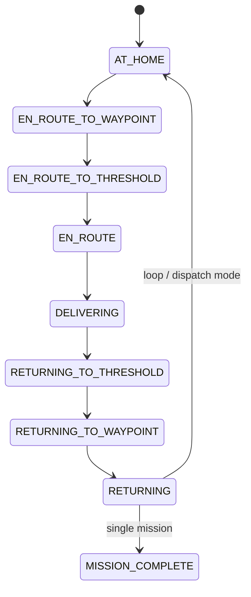

# Hospital Medicine Delivery Swarm

A simulated fleet of three autonomous robots that deliver medicine from home bays in a hospital ward to patient rooms, built with **ROS 2 Jazzy** and **Gazebo Harmonic**.

> This project lives in the `hospital_delivery_swarm/` folder of the repository. The earlier Search-and-Rescue (SAR) swarm work is kept untouched in the repository root.

## Project goal

Show how a small swarm of mobile robots can take over routine medicine-delivery runs in a hospital ward. Each robot leaves its home bay, travels along the hallway, delivers to a room, and returns home, while sharing the same corridor.

The project is built in stages, so each stage can be demonstrated on its own:

1. **Fixed missions (working):** each robot has its own room and runs a full delivery cycle.
2. **Dispatch mode (experimental):** a dispatcher receives room requests and sends the nearest idle robot.
3. **Smarter coordination (planned):** queueing, priorities and robot-to-robot avoidance.

## Current status

| Feature | Status |
|---|---|
| 3 robots spawn, each runs home, deliver, return, `MISSION_COMPLETE` | Verified in two consecutive full runs (Ubuntu in a VMware VM) |
| Mission-swap diagnostic (robot1 and robot2 missions exchanged) | Done; it exposed the odometry bug described under Design notes |
| Dispatcher: nearest idle robot takes a room request | Experimental: launches and reports ready; request handling not yet verified end to end |
| Robot-to-robot avoidance when paths cross | Not tested |
| Request queue and priority requests | Not implemented |

## How it works

### World layout

The ward is a single straight hallway (y = 0) with rooms opening off it. Each robot starts in its own bay on the hallway.

| Robot | Home (x, y) | Delivers to | Room position (x, y) |
|---|---|---|---|
| robot1 | (-8.0, 0.0) | Pharmacy | (-8.0, 5.25) |
| robot2 | (0.0, 0.0) | Patient Room 1 | (0.0, 5.25) |
| robot3 | (8.0, 0.0) | Patient Room 2 | (8.0, 5.25) |

Each doorway threshold is at y = 3.25.

### Robot behaviour

Every robot runs its own navigator node: a state machine driven by a simple goal-seeking controller. LiDAR obstacle repulsion is used on the first leg of the trip (home to the hallway waypoint).



The route goes home, to a waypoint centred in the hallway in front of the target room, to the doorway, into the room, and back the same way.

### Startup

Robots are spawned one after another, a few seconds apart. Each robot gets its own `ros_gz_bridge` for `cmd_vel`, `odom` and `scan`, and its own navigator node. Each robot's SDF is generated from a template so every instance gets unique names and topics.

## Tech stack

| Layer | Technology |
|---|---|
| Robot middleware | ROS 2 Jazzy |
| Simulator | Gazebo Harmonic |
| ROS-Gazebo bridge | `ros_gz_sim`, `ros_gz_bridge` |
| Language | Python 3.12 (`rclpy`) |
| Build system | `colcon` with `ament_python` |
| Robot model and world | SDF (differential-drive robot with LiDAR, hospital ward world) |
| Development environment | Ubuntu 24.04 in a VMware virtual machine |

## Repository structure

```
ros2-multi-agent-sar-swarm/
├── README.md                          # earlier SAR swarm project
├── ... (SAR scripts and src/)
└── hospital_delivery_swarm/           # this project (ROS 2 package: hospital_swarm)
    ├── README.md
    ├── package.xml
    ├── setup.py
    ├── setup.cfg
    ├── resource/hospital_swarm
    ├── launch/
    │   ├── hospital_swarm.launch.py              # standard mission (verified)
    │   ├── hospital_swarm_swap_test.launch.py    # diagnostic: swaps two missions
    │   └── hospital_swarm_dispatch.launch.py     # dispatch mode (experimental)
    ├── models/diff_drive_robot/model.sdf.template
    ├── scripts/
    │   ├── generate_robot_sdf.py                 # builds one SDF per robot from the template
    │   ├── hospital_navigator.py                 # per-robot mission state machine
    │   ├── dispatch_navigator.py                 # navigator that waits for room assignments
    │   └── dispatcher.py                         # picks the nearest idle robot
    └── worlds/hospital_ward.sdf
```

## Getting started

### Prerequisites

- Ubuntu 24.04
- ROS 2 Jazzy (desktop install)
- Gazebo Harmonic with the ROS bridge: `sudo apt install ros-jazzy-ros-gz`

### Build

```bash
mkdir -p ~/hospital_swarm_ws/src && cd ~/hospital_swarm_ws/src
git clone https://github.com/prat-yussh/ros2-multi-agent-sar-swarm.git
cd ~/hospital_swarm_ws
source /opt/ros/jazzy/setup.bash
colcon build --symlink-install --packages-select hospital_swarm
source install/setup.bash
```

### Run the standard mission

```bash
pkill -9 -f "gz sim"
ros2 launch hospital_swarm hospital_swarm.launch.py
```

Gazebo opens and the robots appear one at a time. After about 60 to 90 seconds each navigator logs `-> MISSION_COMPLETE`.

Tips:

- Between runs, stop the launch with `Ctrl+C` and run `pkill -9 -f "gz sim"` first. Leftover Gazebo processes cause strange behaviour in the next run.
- Re-run `colcon build` after changing any file in the package.
- In a VM without 3D acceleration, Gazebo prints `libEGL` and `VMware: No 3D enabled` warnings. They are harmless.

## Dispatch mode (experimental)

```bash
pkill -9 -f "gz sim"
ros2 launch hospital_swarm hospital_swarm_dispatch.launch.py
```

Robots stay parked at home. About 40 seconds after launch the dispatcher logs `Dispatcher ready`. Then, from a second terminal:

```bash
source ~/hospital_swarm_ws/install/setup.bash
ros2 topic pub --once /room_request std_msgs/msg/String "{data: Room1}"
```

Valid rooms are `Pharmacy`, `Room1` and `Room2`. The dispatcher chooses the idle robot whose home is closest to the requested room, sends the assignment, and marks the robot idle again when it reports `AT_HOME`. If every robot is busy, the request is dropped with a warning.

### ROS interfaces

| Topic | Type | Direction |
|---|---|---|
| `/robotN/cmd_vel` | `geometry_msgs/Twist` | navigator to Gazebo |
| `/robotN/odom` | `nav_msgs/Odometry` | Gazebo to navigator |
| `/robotN/scan` | `sensor_msgs/LaserScan` | Gazebo to navigator |
| `/robotN/mission_status` | `std_msgs/String` | navigator state changes |
| `/robotN/assign_room` | `std_msgs/String` | dispatcher to navigator |
| `/room_request` | `std_msgs/String` | user to dispatcher |

## Design notes

- **Odometry offset.** Gazebo's differential-drive odometry starts at (0, 0) wherever the robot is spawned. The navigator adds each robot's home position to the odometry reading so it works in world coordinates. Without this, only a robot spawned at the origin could finish its mission. It was found with a mission-swap test.
- **Installed scripts.** The SDF generator is installed under `share/hospital_swarm/scripts/` and the executables under `lib/hospital_swarm/` (through `setup.cfg`). The launch files need both.

## Known limitations

- Robots do not yet actively avoid each other on every leg, and two robots meeting head-on in the hallway has not been tested.
- The controller is a hand-written goal-seeking and repulsion scheme with a rule-based dispatcher. There is no learned component yet.
- A third patient room exists in the world but no robot is sent there.
- Results come from simulation on a single VM. Timing varies between runs.

## Roadmap

- Test two robots crossing in the hallway and fix avoidance as needed
- Request queue when all robots are busy
- Urgent requests that jump the queue
- Serve the third patient room
- Add screenshots or a demo recording to this README

## Author

Pratyush ([@prat-yussh](https://github.com/prat-yussh))

## License

MIT. See [LICENSE](LICENSE).
